# Multi-Core Processor

- Fetch & Decode  determine what instruction to run next.
- ALU(Execution unit): performs the operation described by an instruction, which may modify values in the processor's registers or the computer's memory.
- Registers: maintain program state: store value of variables used as inputs and outputs to operations
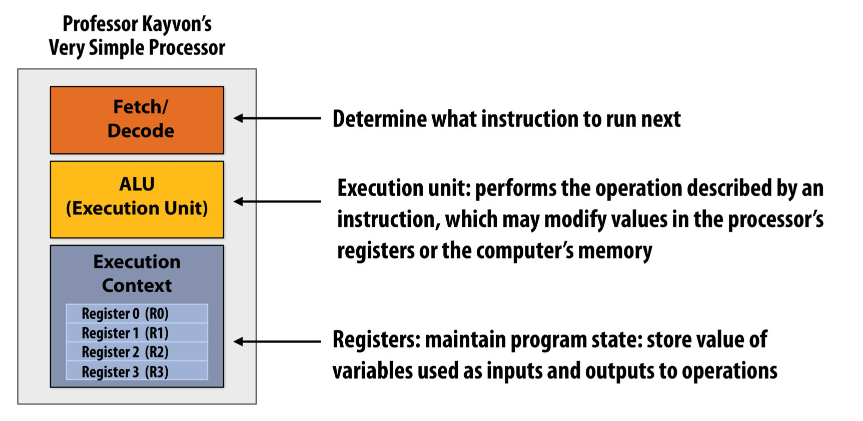
- processor executes one instruction per clock
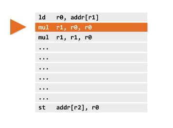
- The processor can do "Superscalar execution": processor automatically finds independent instructions in an instruction sequence and can execute them in parallel on multiple execution units. (super scalar execution is instruction level parallelism)
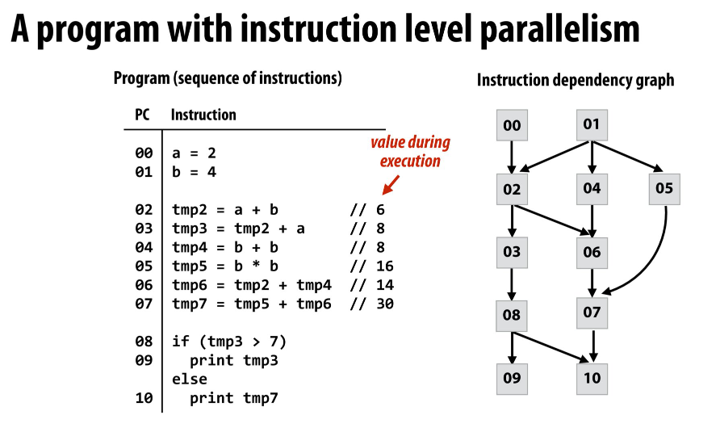
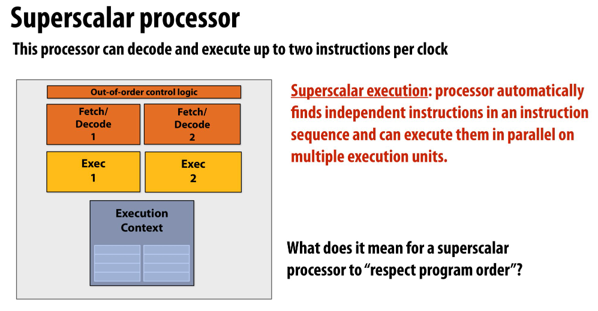
compare simple processor and superscalar processor:
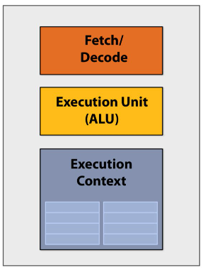
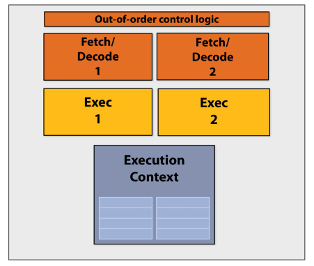
# Memory
## A programs' memory address space (schematics)
A computer's memory is organized as an array of bytes. Each byte is identified by its "Address" in memory (its position in this array)
## What are caches?
- **A cache is a hardware implementation detail that does not impact the output of a program, only its performance**
- Cache is on-chip storage that maintains a copy of a subset of values in memory
- If an address is stored "in the cache" the processor can load/store to this address more quickly than if the data resides only in DRAM
- caches operate at the granularity of "cache lines".

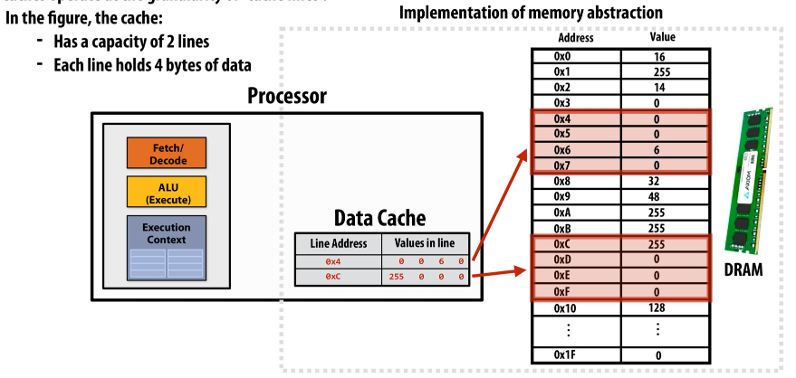

- Two forms of "data locality": 
	- Spatial locality: loading data in a cache line "preloads" the data needed for subsequent access to **different address** in the same line, leading to cache hits
	- Temporal locality: repeated access to the **same address** result in hits.
- And **Cache reduce length of stalls**, in other words, **cache reduce memory access latency**
	- Processors run efficiently when they access data that is resident in caches
	- cache reduces memory access latency when processors access data that they have recently accessed!
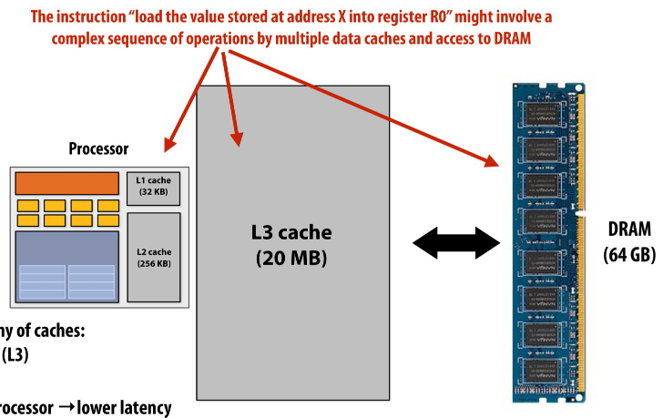
cache miss: find in L1, than L2, than L3 than DRAM

If program is not cache friendly...
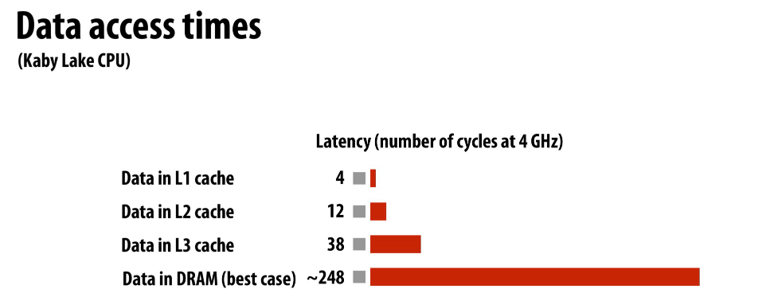

# **Key concepts about how modern parallel processors achieve high throughput**:
- Two concern parallel execution (multi-core, SIMD parallel execution)
- One address the challenges of memory latency(multi-threading)

# Pre multi-core era processor
- Majority of chip transistors used to perform operations that help make a **single** instruction stream run fast.
- More transistors = larger cache, smarter out-of-order logic, smarter branch predictor, etc.
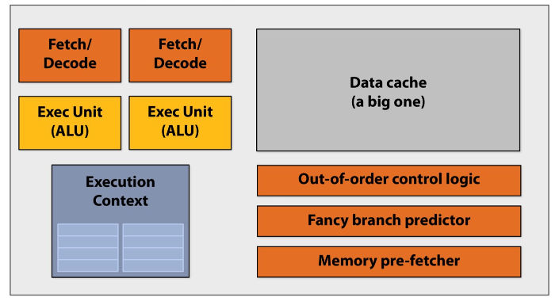

## Idea #1: Two cores: compute two elements in parallel
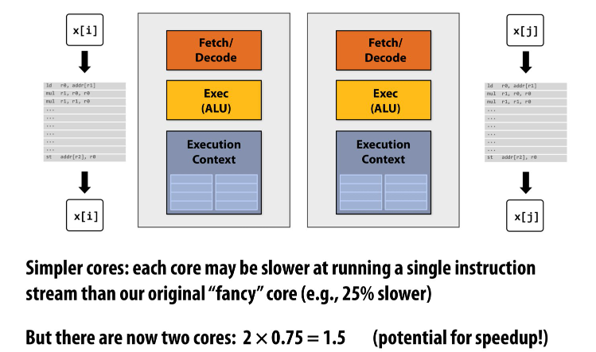with two simple "core", which is 25% slower than previous sophisticated single core, but can achieve 150% potential performance.

However, we need to change our code...

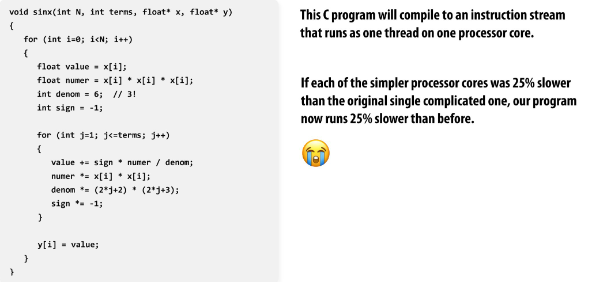

change code, spawn threads to use both core!

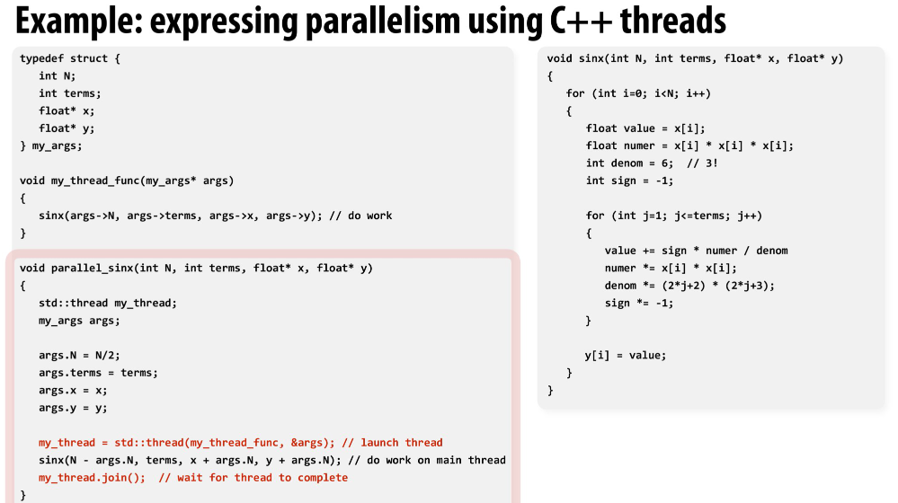

What if there is a way to declares that loop iterations are parallel???

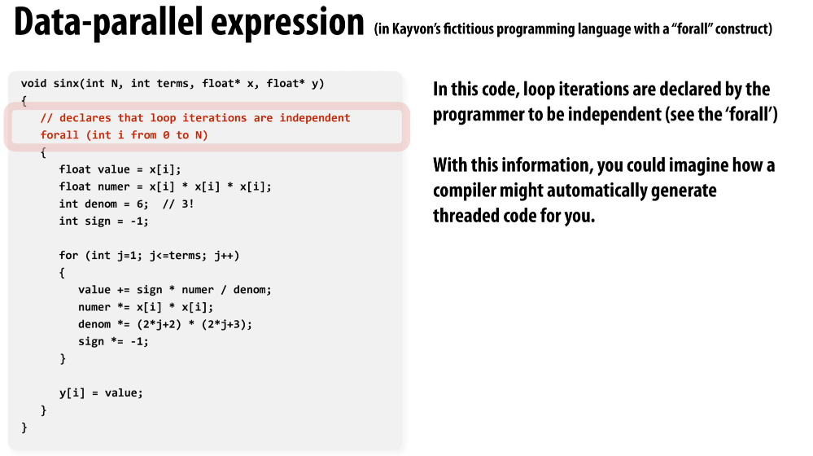

>"In a lot of these modern applications,  machine learning, graphics, any kind of numerical computing or data science, you often work on code like this: 'I've got a big array of values, I've got a tensor, I need to do the same thing on everything.' "

## Idea #2: Amortize cost/complexity of managing an instruction stream across many ALUs

### SIMD processing
Single Instruction, multiple data

Same instruction broadcast to all ALUs
This operation is executed in parallel on all ALUs
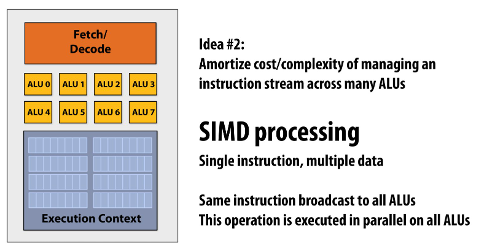